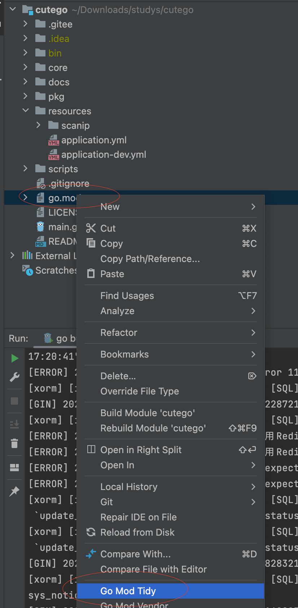
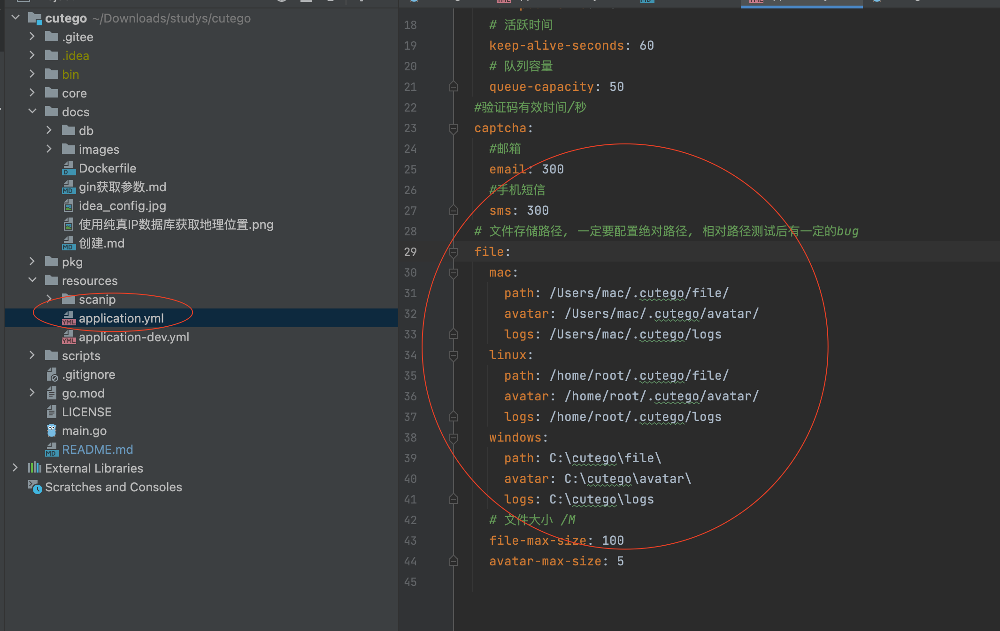

<h1 align="center" style="margin: 30px 0 30px; font-weight: bold;">1.0.0</h1>
<h4 align="center">基于Gin、Xorm、Vue前后端分离的Go快速开发框架</h4>
<p align="center">
	<a href="https://gitee.com/odboy/cutego/stargazers"></a>
	<a href="https://gitee.com/odboy/cutego/blob/master/LICENSE"></a>
</p>

#### 介绍
CuteGo是一套全部开源的快速开发平台，毫无保留给个人及企业免费使用

* 前端采用Vue、Element UI
* 后端采用Gin、Xorm、自定义RBAC、Redis & Jwt, 未使用Casbin

#### 软件架构
1. 用户管理：系统用户配置
2. 部门管理：配置系统组织机构（公司、部门、小组）, 树结构展现支持数据权限
3. 岗位管理：配置系统用户所属担任职务
4. 菜单管理：配置系统菜单, 操作权限, 按钮权限标识等
5. 角色管理：角色菜单权限分配、设置角色按机构进行数据范围权限划分
6. 字典管理：对系统中经常使用的一些较为固定的数据进行维护
7. 参数管理：对系统动态配置常用参数
8. 定时任务：定时调度执行方法, 方法注册在 core/job/index.go (调度日志 下次再写了)


#### 安装教程

- 1、安装golang运行环境

- 2、设置代理, 配置 GOPROXY 环境变量

  ```
  # 先执行
  go env -w GO111MODULE=on
  go env -w GOPROXY=https://goproxy.cn,direct
  ```

  - Bash (Linux or macOS)

  ```
  # 后执行
  export GOPROXY=https://goproxy.io,direct
  ```

  - PowerShell (Windows)

  ```
  # 后执行
  $env:GOPROXY = "https://goproxy.io,direct"
  ```

- 3、将docs下的configs目录移动到cutego目录下
  

- 4、idea配置如下
  

- 5、下载依赖 go mod tidy
  

#### 使用说明

1. 默认账号密码

   ```
   账号：admin 密码：123456
   ```

2. 调整日志和文件存储路径

   

#### 编码顺序推荐

```
[core] entity -> dao -> service -> api -> xx_router -> router

eg.
[模块名称] entity -> dao -> service -> api -> router
```

#### 交叉编译, 产出可执行程序

```
# Mac 下编译 Linux 和 Windows 64位可执行程序
CGO_ENABLED=0 GOOS=linux GOARCH=amd64 go build main.go
CGO_ENABLED=0 GOOS=windows GOARCH=amd64 go build main.go

# Linux 下编译 Mac 和 Windows 64位可执行程序
CGO_ENABLED=0 GOOS=darwin GOARCH=amd64 go build main.go
CGO_ENABLED=0 GOOS=windows GOARCH=amd64 go build main.go

#Windows 下编译 Mac 和 Linux 64位可执行程序
SET CGO_ENABLED=0
SET GOOS=darwin
SET GOARCH=amd64
go build main.go

SET CGO_ENABLED=0
SET GOOS=linux
SET GOARCH=amd64
go build main.go

# GOOS：目标平台的操作系统（darwin、freebsd、linux、windows）
# GOARCH：目标平台的体系架构（386、amd64、arm）
# 交叉编译不支持 CGO 所以要禁用它

# 上面的命令编译的是 64 位可执行程序，当然你也可以使用 386 编译 32 位可执行程序

# 注意!!
windows下面 PowerShell不行，要CMD
```


#### 参与贡献

1.  Fork 本仓库
2.  新建 Feat_xxx 分支
3.  提交代码
4.  新建 Pull Request

#### 感谢（排名不分先后）

- gin框架 [https://github.com/gin-gonic/gin](https://github.com/gin-gonic/gin)

- gotool [https://github.com/druidcaesa/gotool](https://github.com/druidcaesa/gotool)

- RuoYi-Vue [https://gitee.com/y_project/RuoYi-Vue](https://gitee.com/y_project/RuoYi-Vue)

- Jwt-go [https://github.com/dgrijalva/jwt-go](https://github.com/dgrijalva/jwt-go)

- excelize [https://github.com/qax-os/excelize](https://github.com/qax-os/excelize)

- xorm [https://github.com/go-xorm/xorm](https://github.com/go-xorm/xorm)

- 纯真IP库 [https://www.cz88.net/](https://www.cz88.net/)

- robfig/cron定时任务框架 [https://pkg.go.dev/github.com/robfig/cron?utm_source=godoc](https://pkg.go.dev/github.com/robfig/cron?utm_source=godoc)

### 支持
如果觉得本项目还不错或在工作中有所启发，请在Gitee(码云)帮开发者点亮星星，这是对开发者最大的支持和鼓励！

