# CuteGo前端

#### 介绍
引用RuoYi前端

#### 软件架构
ES6、vue2、vuex、vue-router、vue-cli、axios、element-ui

#### 页面预览
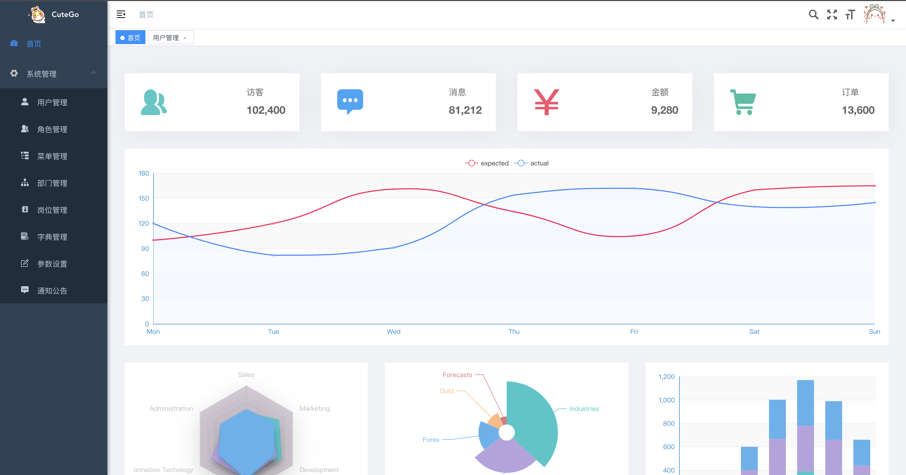   
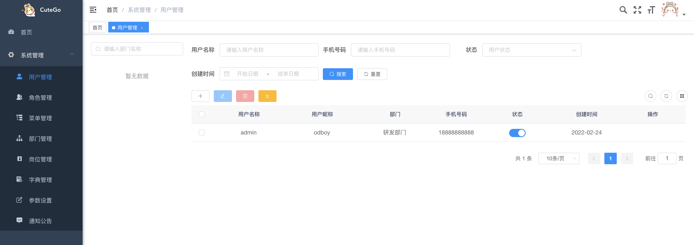   
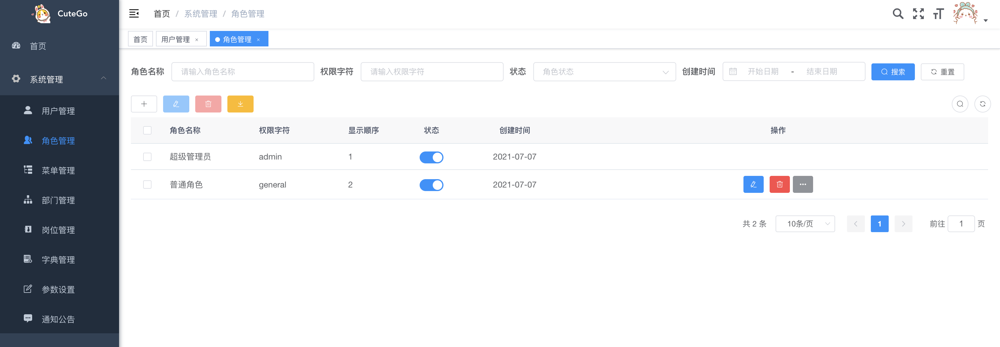   
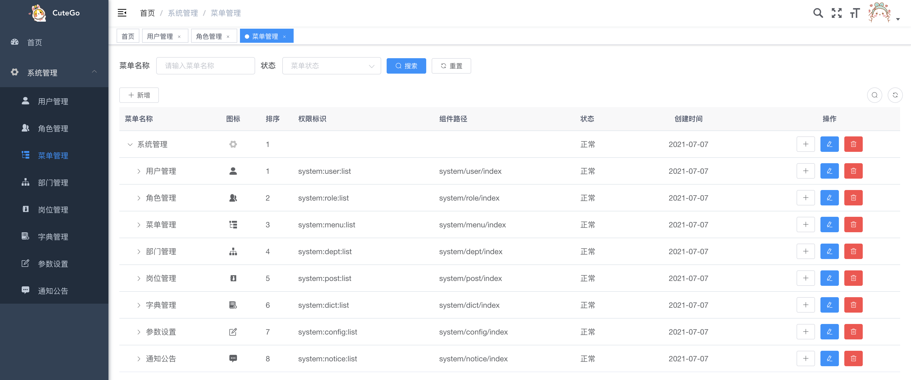   
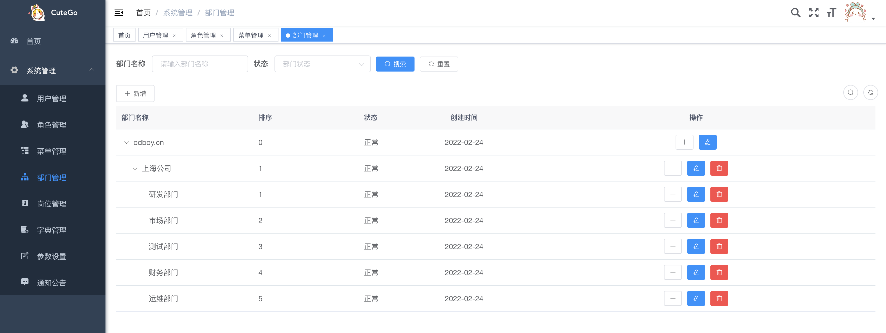   
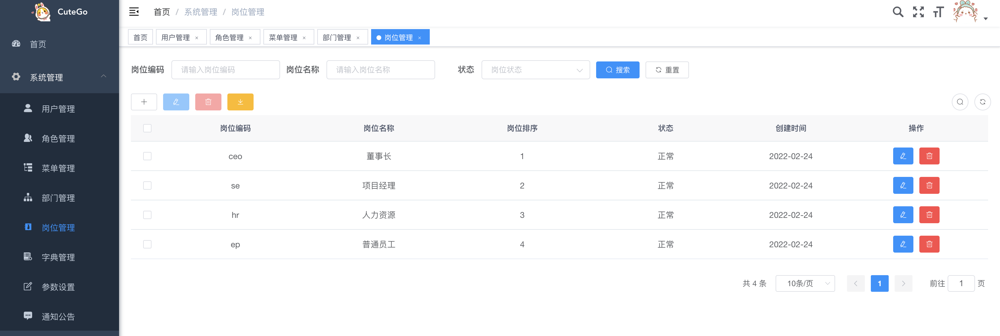   
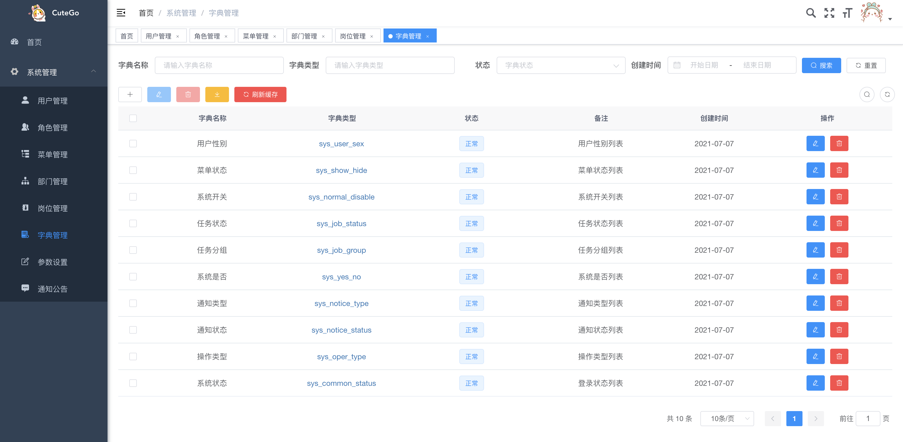   
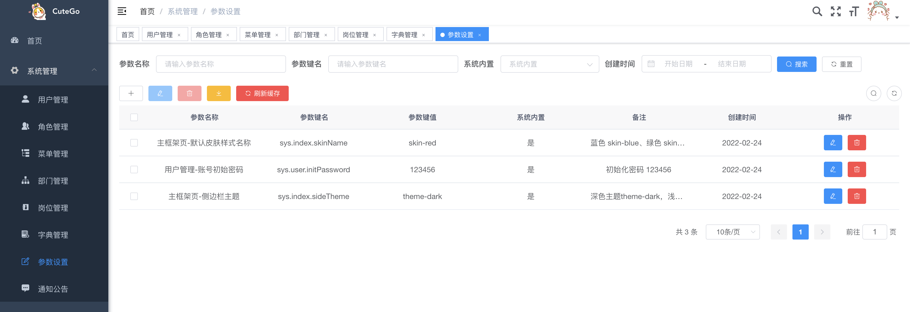   
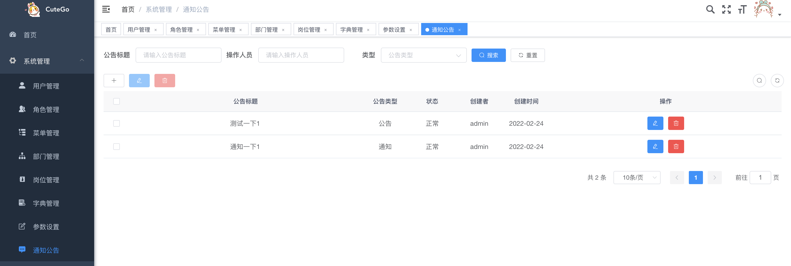   

#### 安装教程

```
# 进入项目目录
cd cutego-ui

# 安装依赖，生成node_modules文件
npm install --registry https://registry.npmmirror.com --save
```
#### idea配置
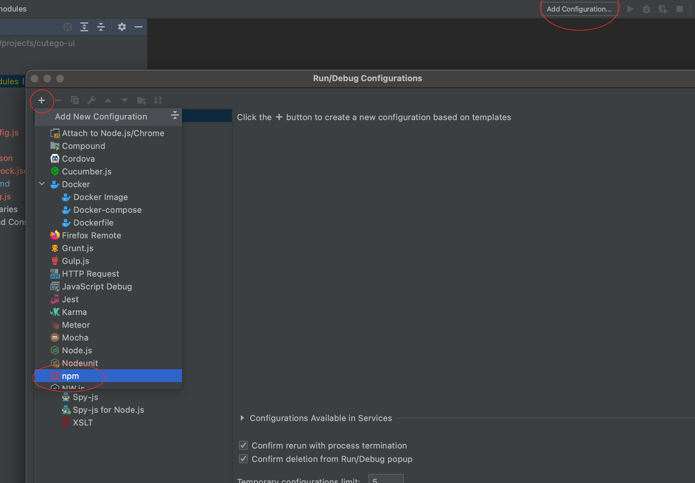
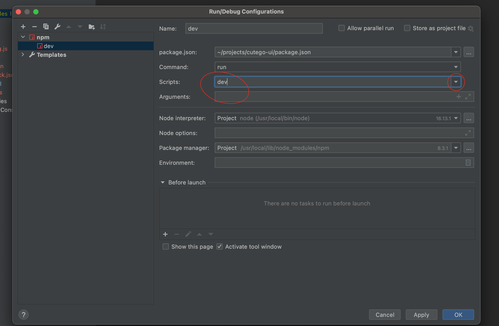

#### 使用说明

```
# 启动服务(使用 Vue 运行 Web 工程)
npm run dev

# 浏览器访问
http://localhost:16379

# 默认账号密码
用户名  admin   密码  123456
```

#### 发布

```
# 构建测试环境
npm run build:stage

# 构建生产环境(打包Web工程，生成dist文件)
npm run build:prod
```

#### 参与贡献

1.  Fork 本仓库
2.  新建 Feat_xxx 分支
3.  提交代码
4.  新建 Pull Request

### 支持
如果觉得本项目还不错或在工作中有所启发，请在Gitee(码云)帮开发者点亮星星，这是对开发者最大的支持和鼓励！

